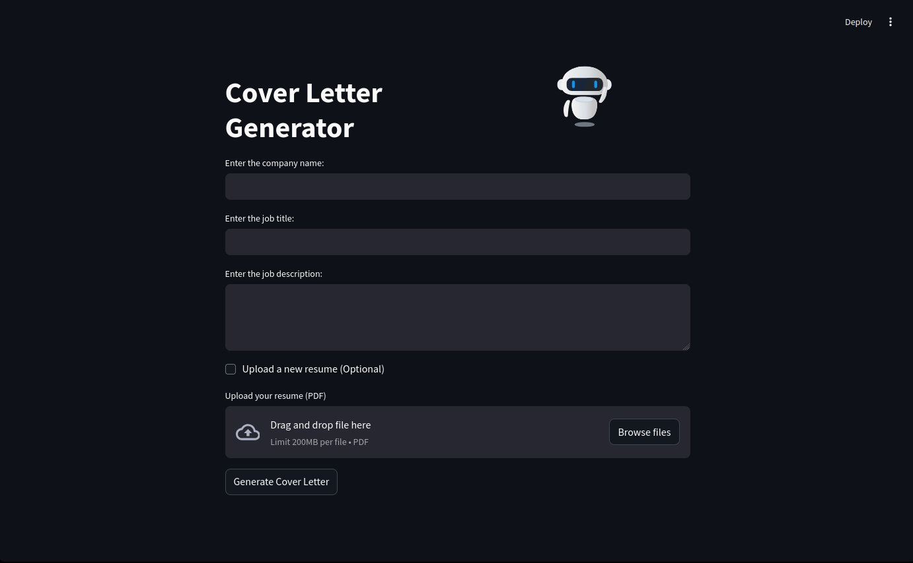

# Cover Letter Generator App

In today's competitive job market, many recruiters use AI-powered tools to filter out candidates based on specific criteria, and unfortunately, many applications are rejected by automated systems before they even reach human eyes. This app is designed to **help candidates stand out** by utilizing AI to generate a personalized cover letter tailored to specific job descriptions with minimum efforts possible. It will generate a pdf that can be used to directly send out to the recruiters. May it serve you well

### Screenshot


## Prerequisites

Before running the app, make sure the following dependencies are installed:

- **Python**: Ensure that Python 3 is installed. If it's not, you can download it from [Python Downloads](https://www.python.org/downloads/).
- **Ollama**: This app requires Ollama to run certain models. Install it from [Ollama Download](https://ollama.com/download/).

### Windows Binary
For Windows users, the app is packaged as a binary, so no need to install Python or Ollama manually. When you run the app for the first time, the setup process will automatically handle installing dependencies and setting up the environment. It can be found in the release version

### Running the App (Windows)

1. **Download the Windows binary** for the app.
2. **Run the binary**:
    - On the first launch, the binary will automatically check for Python and Ollama.
    - If they are not installed, it will guide you to install them.
    - Once installed, it will set up a Python virtual environment and install the required dependencies.

3. **Start the app**:
    - After setup, the app will launch in your default web browser.

### Running the App (Linux)

For Linux users, use the Makefile to install dependencies, create a virtual environment, and run the app.

#### Steps for Linux:

1. **Clone this repository** to your local machine:
    ```bash
    git clone https://github.com/yourusername/cover-letter-generator.git
    cd cover-letter-generator
    ```

2. **Ensure you have the required tools** installed:
    - Python 3 and Pip
    - Ollama

3. **Run the Makefile**:
    - The Makefile will take care of setting up the virtual environment and installing the dependencies.
    ```bash
    make
    ```

4. **Rerun the app**:
    - Once the setup is complete, it will run the app. But if you want to rerun it:
    ```bash
    ./run.sh
    ```

The app will open in your default browser at `http://localhost:8501`.


### Additional Information

- **Configuration**: The app stores user data in a `details.json` file and generates a PDF cover letter based on the input.
- **Files Generated**: The cover letter PDFs are saved in the `coverLetter` folder.
- **LLM Model**: DeepSeek-r1 reasoning model is used. 


